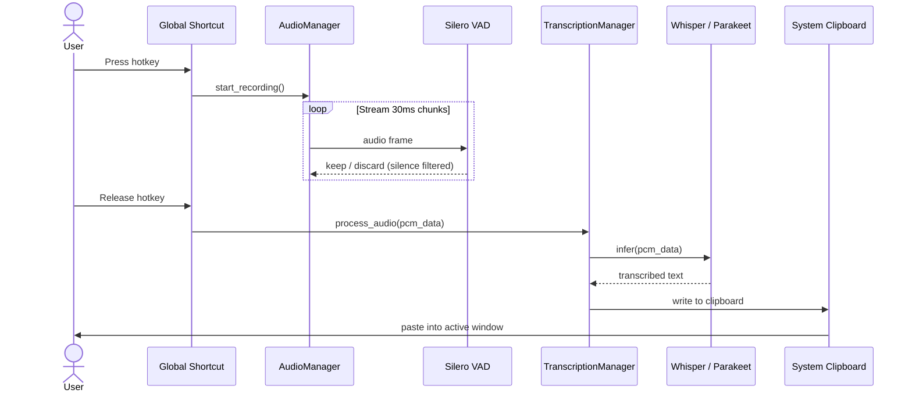
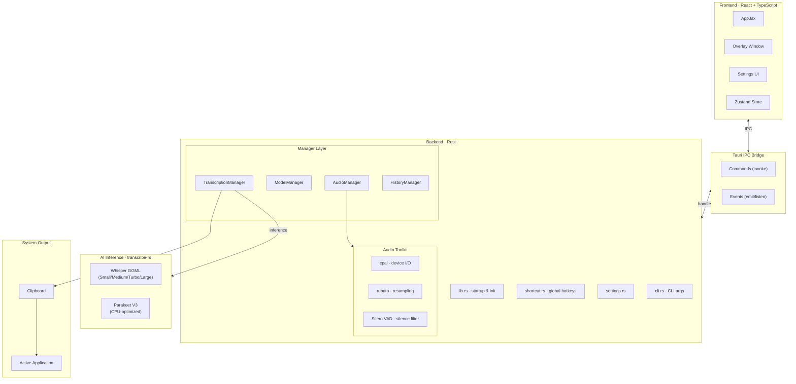
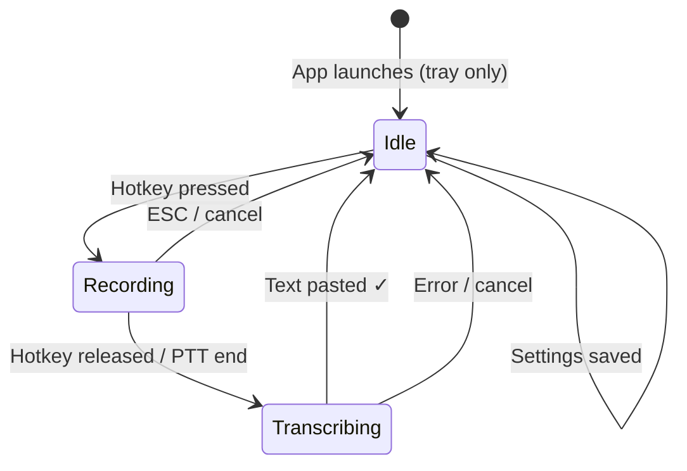

<div align="center">
  

  # Handy

  **Free, open source, offline speech-to-text. Press a key. Speak. Done.**

  [](https://discord.com/invite/WVBeWsNXK4)
  [](LICENSE)
  [](https://github.com/cjpais/Handy/releases)
  []()

  [Download](https://github.com/GalaxyRuler/Verbatim/releases) · [Website](https://handy.computer) · [Discord](https://discord.com/invite/WVBeWsNXK4) · [Discussions](https://github.com/cjpais/Handy/discussions)
</div>

---

> This project builds on **[Handy](https://github.com/cjpais/Handy)** by [CJ Pais](https://github.com/cjpais) — the most forkable offline speech-to-text application. See [About This Fork](#about-this-fork) for what's been built on top.

---

Handy is a cross-platform desktop application that provides privacy-focused speech transcription. Press a shortcut, speak, and have your words appear in any text field — entirely on your own computer, with no audio ever leaving your device.

## Why Handy?

- **Free** — Accessibility tooling belongs in everyone's hands, not behind a paywall
- **Open Source** — Together we can build further. Extend Handy for yourself and contribute to something bigger
- **Private** — Your voice stays on your computer. No audio sent to the cloud
- **Simple** — One tool, one job. Transcribe what you say and put it into a text box

> Handy isn't trying to be the best speech-to-text app — it's trying to be the most forkable one.

## How It Works

1. **Press** a configurable keyboard shortcut to start recording (or use push-to-talk mode)
2. **Speak** your words while the shortcut is active
3. **Release** and Handy processes your speech using Whisper or Parakeet
4. **Get** your transcribed text pasted directly into whatever app you're using

The process is entirely local — silence filtered by VAD, transcription runs on-device:



**Model options:**
- **Whisper** (Small / Medium / Turbo / Large) — GPU-accelerated, high accuracy
- **Parakeet V3** — CPU-only, ~5× real-time on mid-range hardware, auto language detection

Works on Windows, macOS, and Linux.

## Architecture

Handy is a Tauri 2.x application: Rust backend handles system integration and ML inference; React/TypeScript frontend handles settings and overlay UI.



### Application State



### Key Patterns

| Pattern | Implementation |
|---|---|
| Manager pattern | `AudioManager`, `ModelManager`, `TranscriptionManager` each own their lifecycle |
| Command-Event | Frontend → Backend via `invoke`; Backend → Frontend via `emit` |
| Single instance | `tauri_plugin_single_instance` — CLI flags route to running process |
| State persistence | `tauri-plugin-store` (JSON), reactive via Zustand |

### Core Stack

| Layer | Technology |
|---|---|
| App framework | Tauri 2.x |
| Frontend | React 18, TypeScript, Tailwind CSS, Zustand |
| Backend | Rust, `cpal`, `rubato`, `rdev` |
| ML inference | `transcribe-rs` (whisper.cpp + Parakeet / ONNX) |
| VAD | Silero VAD via `vad-rs` |
| i18n | i18next (en, de, es, fr, ja, zh, vi + more) |

## Quick Start

### Installation

1. Download the latest release from the [releases page](https://github.com/cjpais/Handy/releases) or [handy.computer](https://handy.computer)
   - **macOS**: `brew install --cask handy`
   - **Windows**: `winget install cjpais.Handy`
2. Launch Handy and grant necessary permissions (microphone, accessibility)
3. Configure your keyboard shortcut in Settings
4. Start transcribing

> The Homebrew cask and winget package track the upstream Handy releases, not this fork.

### Development Setup

For detailed platform-specific build instructions see [BUILD.md](BUILD.md).

```bash
# Prerequisites: Rust (stable), Bun
bun install

# Download required VAD model
mkdir -p src-tauri/resources/models
curl -o src-tauri/resources/models/silero_vad_v4.onnx https://blob.handy.computer/silero_vad_v4.onnx

# Run in development
bun run tauri dev

# macOS cmake workaround
CMAKE_POLICY_VERSION_MINIMUM=3.5 bun run tauri dev
```

## Integrations

<a href="https://www.raycast.com/mattiacolombomc/handy" title="Install Handy Raycast Extension"></a>

Control Handy from [Raycast](https://www.raycast.com) — start/stop recording, browse transcript history, manage dictionary, switch models and languages.

[Source](https://github.com/mattiacolombomc/raycast-handy) · by [@mattiacolombomc](https://github.com/mattiacolombomc)

## CLI Parameters

All platforms support CLI flags for scripting, window managers, and autostart.

**Remote control** (routes to running instance via single-instance plugin):

```bash
handy --toggle-transcription    # Toggle recording on/off
handy --toggle-post-process     # Toggle recording with post-processing
handy --cancel                  # Cancel current operation
```

**Startup flags:**

```bash
handy --start-hidden            # Start without showing the main window
handy --no-tray                 # Start without system tray (close = quit)
handy --debug                   # Enable verbose (Trace) logging
```

Combine flags for autostart:

```bash
handy --start-hidden --no-tray
```

> **macOS app bundle:** `/Applications/Handy.app/Contents/MacOS/Handy --toggle-transcription`

### Unix Signals (Linux / macOS)

| Signal | Action |
|---|---|
| `SIGUSR2` | Toggle transcription |
| `SIGUSR1` | Toggle with post-processing |

```bash
pkill -USR2 -n handy   # toggle from a hotkey daemon
```

### Wayland Global Shortcuts

On Wayland, configure system-level shortcuts using CLI flags:

**GNOME:** Settings → Keyboard → Custom Shortcuts → command: `handy --toggle-transcription`

**KDE Plasma:** System Settings → Shortcuts → Custom Shortcuts → Action: `handy --toggle-transcription`

**Sway / Hyprland:**
```ini
# Sway
bindsym $mod+o exec handy --toggle-transcription

# Hyprland
bind = $mainMod, O, exec, handy --toggle-transcription
```

## Debug Mode

Press `Cmd+Shift+D` (macOS) or `Ctrl+Shift+D` (Windows/Linux) to open debug mode with detailed diagnostics, log paths, and audio device info.

## Known Issues & Limitations

### Whisper Model Crashes

Whisper models crash on certain system configurations (Windows and Linux). Not all systems are affected. If you're a developer experiencing this, please attach debug logs to the issue tracker.

### Wayland

Limited global shortcut support. Install `wtype` or `dotool` for text input and configure shortcuts via CLI flags (see above).

### Linux Text Input Dependencies

| Display Server | Tool | Install |
|---|---|---|
| X11 | `xdotool` | `sudo apt install xdotool` |
| Wayland | `wtype` | `sudo apt install wtype` |
| Both | `dotool` | `sudo apt install dotool` |

Without these, Handy falls back to `enigo` which has limited Wayland compatibility.

### Linux Runtime Library

If startup fails with `libgtk-layer-shell.so.0`:

| Distro | Command |
|---|---|
| Ubuntu/Debian | `sudo apt install libgtk-layer-shell0` |
| Fedora/RHEL | `sudo dnf install gtk-layer-shell` |
| Arch | `sudo pacman -S gtk-layer-shell` |

Set `HANDY_NO_GTK_LAYER_SHELL=1` to skip GTK layer shell initialization entirely (falls back to always-on-top window).

### Overlay & Pasting (Linux)

The recording overlay can steal focus and block pasting on Linux (X11). Fix: **Settings → Advanced → Overlay Position → None**. Enable **Audio Feedback** for audible recording confirmation.

### Platform Support

| Platform | Status |
|---|---|
| macOS (Apple Silicon + Intel) | ✅ |
| Windows x64 | ✅ |
| Linux x64 | ✅ (see notes above) |

## System Requirements

**Whisper models:**
- macOS: M-series or Intel Mac
- Windows/Linux: Any GPU (Intel / AMD / NVIDIA) recommended

**Parakeet V3:**
- CPU-only — minimum Intel Skylake (6th gen) or equivalent AMD
- ~5× real-time on a mid-range i5, no GPU needed

## Manual Model Installation (Proxy / Restricted Networks)

Find your app data directory in **Settings → About** or via debug mode.

| Model | URL | Size |
|---|---|---|
| Whisper Small | `https://blob.handy.computer/ggml-small.bin` | 487 MB |
| Whisper Medium | `https://blob.handy.computer/whisper-medium-q4_1.bin` | 492 MB |
| Whisper Turbo | `https://blob.handy.computer/ggml-large-v3-turbo.bin` | 1.6 GB |
| Whisper Large | `https://blob.handy.computer/ggml-large-v3-q5_0.bin` | 1.1 GB |
| Parakeet V3 | `https://blob.handy.computer/parakeet-v3-int8.tar.gz` | 478 MB |

Place Whisper `.bin` files directly in `{app_data}/models/`. Extract Parakeet archives — the directory must be named `parakeet-tdt-0.6b-v3-int8`.

### Custom Whisper Models

Drop any Whisper GGML `.bin` file into the `models` directory. Handy auto-discovers it and shows it under **Custom Models** in Settings.

## Verify Release Signatures

Release artifacts are signed with Tauri's updater format. Public key is in `src-tauri/tauri.conf.json` under `plugins.updater.pubkey`.

```bash
ARTIFACT="Handy_0.8.3_amd64.AppImage"

python3 - "$ARTIFACT" <<'PY'
import base64, pathlib, sys
artifact = sys.argv[1]
pub = pathlib.Path("handy.pub.b64").read_text().strip()
pathlib.Path("handy.pub").write_bytes(base64.b64decode(pub))
sig = pathlib.Path(f"{artifact}.sig").read_text().strip()
pathlib.Path(f"{artifact}.minisig").write_bytes(base64.b64decode(sig))
PY

minisign -Vm "$ARTIFACT" -p handy.pub -x "$ARTIFACT.minisig"
```

## Linux Startup Troubleshooting

1. **Install/reinstall `gtk-layer-shell`** — most common cause of startup failures
2. **Disable overlay**: `HANDY_NO_GTK_LAYER_SHELL=1 handy`
3. **Disable WebKit DMA-BUF**: `WEBKIT_DISABLE_DMABUF_RENDERER=1 handy`

Make permanent in `~/.bashrc` or the `.desktop` `Exec=` line:
```ini
Exec=env HANDY_NO_GTK_LAYER_SHELL=1 handy
```

## Roadmap

| Item | Status |
|---|---|
| Debug logging to file | In progress |
| Globe key support (macOS) | In progress |
| Opt-in anonymous analytics | In progress |
| Settings system refactor | Planned |
| Tauri commands cleanup (tauri-specta) | Planned |

## About This Fork

This repository builds on **[Handy](https://github.com/cjpais/Handy)** — a cross-platform offline speech-to-text desktop app by [CJ Pais](https://github.com/cjpais). Handy's design philosophy (simple, forkable, private) made it the right foundation to build on.

<!-- TODO: Describe what this fork adds or changes relative to upstream Handy -->

Upstream project: [github.com/cjpais/Handy](https://github.com/cjpais/Handy)  
Original website: [handy.computer](https://handy.computer)

## About the Maintainer

Maintained by **[@GalaxyRuler](https://github.com/GalaxyRuler)**.

Building on open source foundations to make speech-to-text accessible, extensible, and entirely private. Contributions, bug reports, and forks are welcome.

## Contributing

Bug fixes are the top priority — there are [60+ open issues](https://github.com/cjpais/Handy/issues). New features require community support via [Discussions](https://github.com/cjpais/Handy/discussions) before a PR is opened. See [CONTRIBUTING.md](CONTRIBUTING.md) for the full workflow.

**TL;DR:**
1. Search [issues](https://github.com/cjpais/Handy/issues) and [PRs](https://github.com/cjpais/Handy/pulls) (including closed ones) first
2. Fork → feature branch → `bun run lint && bun run format:check`
3. Test on your target platform
4. Fill out the PR template completely (human-written description required)

For translations see [CONTRIBUTING_TRANSLATIONS.md](CONTRIBUTING_TRANSLATIONS.md).

## Sponsors

<div align="center">
  <br>
  <a href="https://wordcab.com">
    
  </a>
  &nbsp;&nbsp;&nbsp;&nbsp;
  <a href="https://github.com/epicenter-so/epicenter">
    
  </a>
  &nbsp;&nbsp;&nbsp;&nbsp;
  <a href="https://boltai.com?utm_source=handy">
    
  </a>
  <br><br>
  <em>Sponsors support the upstream Handy project.</em>
</div>

## Related Projects

- **[Handy (upstream)](https://github.com/cjpais/Handy)** — original project by CJ Pais
- **[Handy CLI](https://github.com/cjpais/handy-cli)** — original Python command-line version
- **[handy.computer](https://handy.computer)** — project website

## License

MIT — see [LICENSE](LICENSE).

Built on Handy (MIT © 2025 CJ Pais). Modifications in this fork are also MIT.

## Acknowledgments

- **[OpenAI Whisper](https://github.com/openai/whisper)** — speech recognition model
- **[whisper.cpp](https://github.com/ggerganov/whisper.cpp)** and **[ggml](https://github.com/ggerganov/ggml)** — cross-platform inference / acceleration
- **[Silero VAD](https://github.com/snakers4/silero-vad)** — lightweight voice activity detection
- **[Tauri](https://tauri.app)** — Rust-based app framework
- **[CJ Pais](https://github.com/cjpais)** and all upstream Handy contributors
